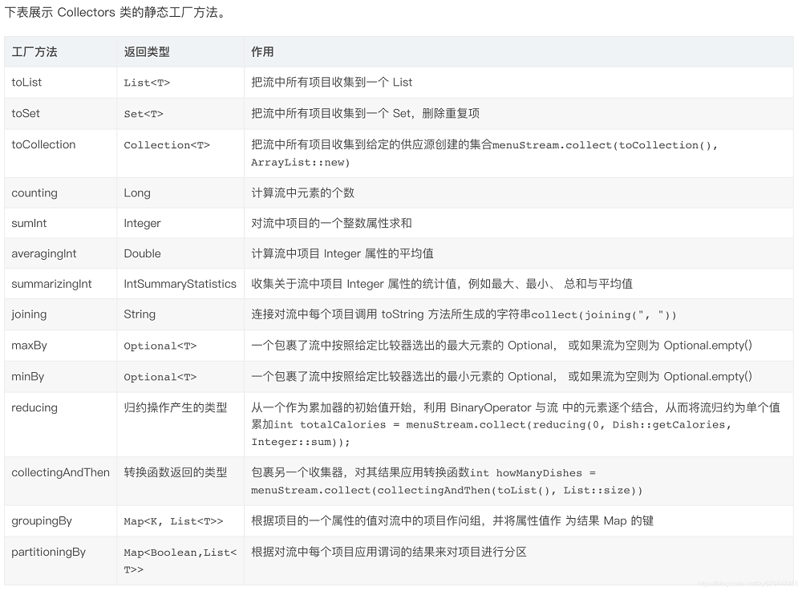

Java 8 API 添加了一个新的抽象称为流 Stream，可以让你以一种声明的方式处理数据。

Stream API 可以极大提高 Java 程序员的生产力，让程序员写出高效率、干净、简洁的代码。这种风格将要处理的元素集合看作一种流， 流在管道中传输， 并且可以在管道的节点上进行处理， 比如筛选， 排序，聚合等。

```bash
+--------------------+       +------+   +------+   +---+   +-------+
| stream of elements +-----> |filter+-> |sorted+-> |map+-> |collect|
+--------------------+       +------+   +------+   +---+   +-------+
```

## 生成 Stream

生成 Stream 的方法比较多样。

```java
String[] input = {"a","b","c"};//流中的元素
Stream<String> stream = Arrays.stream(input);
Stream<String> stream1 = Stream.of(input);
Stream<String> stream2 = Arrays.asList(input).stream();
Stream<Integer> limit = Stream.iterate(0, x -> x + 1).limit(10);//0123456789
Stream<String> limit1 = Stream.generate(() -> "x").limit(10);//xxxxx_xxxxx
```

## Stream 中间操作

### 1.filter

对于 filter 的函数定义`Stream<T> filter(Predicate<? super T> predicate)`。传入一个 Predicate 的函数接口，该接口传入一个泛型参数 T，做完操作之后，返回一个 boolean 值；filter 方法的作用，是对返回值 boolean 做判断，返回 true 判断之后的对象，一般用作过滤算法。

```java
Arrays.asList(1,2,3,4,5).stream()
    .filter(x->x%2==0) //保留偶数在stream流中
```

### 2.map

对于 map 的函数定义`<R> Stream<R> map(Function<? super T, ? extends R> mapper)`。传入的函数是接收一个泛型 T，返回泛型 R，并且返回的是泛型 R 的 Stream，当调用这个函数后，意味着可以改变返回的类型。

由下面的示例可见，stream3 是 Integer 流，经过 map 操作可以转换成任意类型的流，达到类型的转换操作。

```java
Stream<Integer> stream3 = Arrays.asList(1, 2, 3, 4, 5).stream();
Stream<String> output = stream3.map(x -> {
    String s = String.valueOf(x);
    return "student_"+s;
});
```

### 3.flatMap

对于 flatMap 函数的定义`<R> Stream<R> flatMap(Function<? super T, ? extends Stream<? extends R>> mapper)`。跟 map 一样接收一个 Fucntion 的函数式接口，但 Function 接收的泛型参数不同的，而对于 flatMap 的参数是一个 Stream 流；返回的也是泛型 R，具体的作用是把两个流，变成一个流返回。

```java
Stream<String> stream4 = Arrays.stream(new String[]{"aaa", "bbb", "ccc"});
Stream<String[]> stream5 = stream4.map(str -> str.split(""));//1
Stream<String> stringStream =
    stream4.map(str -> str.split("")).flatMap(Arrays::stream);//2
Stream<String> stringStream1 =
    stream4.map(str -> str.split("")).flatMap(str -> Arrays.stream(str));
stringStream1.forEach(System.out::println);//3 输出为aaabbbccc
```

通过上面的示例，可见对于 1 处的代码，返回的是 String[],并且流的长度不变(为 3)，而对于 2 处的代码，将 map 返回的`Stream<String[]>`,继续整合到 flatMap 中，展开得到`Stream<String>`。

### 4.distinct、sorted、peek

```java
//去重复元素，比较方法是利用hashCode和equals
Stream<T> distinct();
//排序
Stream<T> sorted();
//根据属性排序
Stream<T> sorted(Comparator<? super T> comparator);
//对对象的进行操作，他一般不会改变流(对象除外),并且不是终止操作
Stream<T> peek(Consumer<? super T> action);
```

```java
Stream<String> input = Stream.of("one", "two", "three", "four", "one");
//distinct
Stream<String> distinct = input.distinct(); //"one", "two", "three", "four"
//sorted
Stream<String> distinct = input.sorted();//默认为升序排列
//sorted
Stream<Student> input = Stream.of(new Student(23,"x1"), new Student(25,"x3"), new Student(24,"x2"));
Stream<Student> sorted = input.sorted(
    (o1, o2) -> {
    return o1.getAge() - o2.getAge();
    });
sorted.forEach(System.out::println);
//peek,将学生的年龄扩大两倍
input.peek(o->o.setAge(o.getAge()*2)).forEach(System.out::println);
//值得注意的是，下面的操作不会将字符转换成大写字母
Stream.of("one", "two", "three","four")
    .peek(u -> u.toUpperCase())
    .forEach(System.out::println);
```

最后两个示例的差异之处在于函数的定义，peek 接收一个 Consumer，而 map 接收一个 Function。

Consumer 是没有返回值的，它只是对 Stream 中的元素进行某些操作，但是操作之后的数据并不返回到 Stream 中，所以 Stream 中的元素还是原来的元素；而 Function 是有返回值的，这意味着对于 Stream 的元素的所有操作都会作为新的结果返回到 Stream 中。

### 5.limit，skip

```java
//截断，取先maxSize个对象
Stream<T> limit(long maxSize);
//截断，忽略前N个对象
Stream<T> skip(long n);
//示例，23456789
Stream.iterate(0, x -> x + 1).limit(10).skip(2).forEach(System.out::print);
```

## Stream 的终结操作

### 1.forEachOrdered 和 forEach

```java
void forEach(Consumer<? super T> action);
void forEachOrdered(Consumer<? super T> action);
```

以上是这两个函数的定义，这两个函数都是对集合的流进行遍历操作，是属于内部迭代的函数，`forEachOrdered`函数函数是按顺序进行处理，而`forEach`是按并行处理。

```java
List<String> strs = Arrays.asList("a","d","c","b");
strs.stream().forEachOrdered(System.out::print);//adcb
System.out.println();
strs.stream().forEach(System.out::print);//adcb
System.out.println();
strs.parallelStream().forEachOrdered(System.out::print);//adcb
System.out.println();
strs.parallelStream().forEach(System.out::print);//bcda
```

通过上面的示例，对于 parallel 操作后，forEach 操作是并行的，乱序的。而对于 forEachOrdered 则是有序的，这个顺序是 Stream 的构造顺序，而非逻辑顺序。

### 2.toArray

```java
Object[] toArray();
<A> A[] toArray(IntFunction<A[]> generator);
```

对于 toArray 函数主要是以上两个，它的目的是将 Stream 中的元素收集为数组[]的形式。

```java
List<String> strs = Arrays.asList("a","d","c","b");
//返回的对象都是["a","d","c","b"]
String[] strings = strs.stream().toArray(str -> new String[strs.size()]);
String[] strings1 = strs.stream().toArray(String[]::new);
Object[] objects = strs.stream().toArray();

String[] strings2 = strs.toArray(new String[strs.size()]);
Object[] objects1 = strs.toArray();
```

### 3.count、anyMatch、allMatch 和 noneMatch

```java
long count();
//判断的条件里，任意一个元素成功，返回true
boolean anyMatch(Predicate<? super T> predicate);
//判断条件里的元素，所有的都是，返回true
boolean allMatch(Predicate<? super T> predicate);
//判断条件里的元素，所有的都不是，返回true
boolean noneMatch(Predicate<? super T> predicate);
```

count 方法，跟 List 接口的 size 一样，返回的都是这个集合流的元素的长度，不同的是流是集合的一个高级工厂，中间操作是工厂里的每一道工序，我们对这个流操作完成后，可以进行元素的数量的和。

```java
List<String> strs = Arrays.asList("a", "a", "a", "a", "b");
boolean aa = strs.stream().anyMatch(str -> str.equals("a"));//true
boolean bb = strs.stream().allMatch(str -> str.equals("a"));//false
boolean cc = strs.stream().noneMatch(str -> str.equals("a"));//false
long count = strs.stream().filter(str -> str.equals("a")).count();//4
```

但是，当 list 为空的时候，对于 allMatch 返回的为 true。通过源码可知，当我们的 list 集合中，size 为 0 的时候，进去遍历的判断的时候，是遍历不进去的，取的默认值 true，所以返回值为 true。

```java
List<String> list = new ArrayList<>();
boolean allMatch = list.stream().allMatch(e -> e.equals("a"));//true
boolean anyMatch = list.stream().anyMatch(e -> e.equals("a"));//false
boolean noneMatch = list.stream().noneMatch(e -> e.equals("a"));//true
```

### 4.reduce

对于 reduce 函数，使用做归约到的，其形式有：

- `Optional<T> reduce(BinaryOperator<T> accumulator)`，该函数式接口需要两个参数，返回一个结果(reduce 中返回的结果会作为下次累加器计算的第一个参数)，也就是累加器。
- `T reduce(T identity, BinaryOperator<T> accumulator)`，提供一个跟 Stream 中数据同类型的初始值 identity，过累加器 accumulator 迭代计算 Stream 中的数据，得到一个跟 Stream 中数据相同类型的结果。
- ` <U> U reduce(U identity, BiFunction<U, ? super T, U> accumulator, BinaryOperator<U> combiner)`，BiFunction 的三个泛型类型分别是 U，? super T、U，参考 BiFunction 函数式接口 apply 方法定义可以知道，累加器累加器通过类型为 U 和? super T 的两个输入值计算得到一个 U 类型的结果返回。也就是说这种 reduce 方法，提供一个不同于 Stream 中数据类型的初始值，通过累加器规则迭代计算 Stream 中的数据，最终得到一个同初始值同类型的结果。

```java
//形式1
Optional<Integer> reduce = Stream.of(1, 2, 3, 4).reduce((acc, item) -> {
    acc += item;
    return acc;
});
//形式2，对规约值设置一个初始化值，形式1默认值为0
Integer reduce1 = Stream.of(1, 2, 3, 4).reduce(100, (acc, item) -> {
    acc += item;
    return acc;
});
//形式3，以newList作为容器，遍历stream对newKList进行修改。
List<Integer> newList = new ArrayList<>(Arrays.asList(1,2,3));
List<Integer> reduce2 = Stream.of(1, 2, 3, 4)
    .reduce(newList,
            (acc, item) -> {
                acc.add(item);
                return acc;
            }, (acc, item) -> null);
System.out.println("reduce1="+reduce+",reduce1="+reduce1+",reduce2="+reduce2);
System.out.println(newList);
//运行结果如下
reduce1=Optional[10],reduce1=110,reduce2=[1, 2, 3, 1, 2, 3, 4]
[1, 2, 3, 1, 2, 3, 4]
```

### 5.collect

collect 是一种归约操作的方式，收集器操作可以当做是一种更高级的归约操作。对于其函数定义如下：

```java
<R> R collect(Supplier<R> supplier,BiConsumer<R, ? super T> accumulator,BiConsumer<R, R> combiner);
<R, A> R collect(Collector<? super T, A, R> collector);//常用方法，对于Collectors里面的静态方法见下图
```



```java
public static List<Emp> list = new ArrayList<>();
static class Emp {
    private String address;
    private String name;
    private Integer age;
}
static {
    list.add(new Emp("上海", "小名", 17));
    list.add(new Emp("北京", "小红", 18));
    list.add(new Emp("深圳", "小蓝", 19));
}

public static void main(String[] args) {
    List<String> names = list.stream()
        .map(emp -> emp.getName())
        .collect(Collectors.toList());// 转list
    Set<String> address = list.stream()
        .map(emp -> emp.getName())
        .collect(Collectors.toSet());// 转set
    // 转map，需要指定key和value，Function.identity()表示当前的Emp对象本身
    Map<String, Emp> map = list.stream()
        .collect(Collectors.toMap(Emp::getName, Function.identity()));
    Long count = list.stream().collect(Collectors.counting()); // 计算元素中的个数 3
    // 数据求和 summingInt summingLong，summingDouble
    Integer sumAges = list.stream()
        .collect(Collectors.summingInt(Emp::getAge)); // 54
    // 平均值 averagingInt,averagingDouble,averagingLong
    Double aveAges = list.stream()
        .collect(Collectors.averagingInt(Emp::getAge));// 18
    // 综合处理的，求最大值，最小值，平均值，求和操作,summarizingInt，summarizingLong,summarizingDouble
    IntSummaryStatistics intSummary = list.stream().collect(Collectors.summarizingInt(Emp::getAge));
    System.out.println(intSummary.getAverage());// 18
    System.out.println(intSummary.getMax());// 19
    System.out.println(intSummary.getMin());// 17
    System.out.println(intSummary.getSum());// 54
    // 连接字符串,当然也可以使用重载的方法，加上一些前缀，后缀和中间分隔符
    String strEmp = list.stream()
        .map(emp -> emp.getName())
        .collect(Collectors.joining());
    String strEmp1 = list.stream()
        .map(emp -> emp.getName())
        .collect(Collectors.joining("-中间的分隔符-"));
    String strEmp2 = list.stream()
        .map(emp -> emp.getName())
        .collect(Collectors.joining("-中间的分隔符-", "前缀*", "&后缀"));
    // maxBy 按照比较器中的比较结果刷选
    Optional<Integer> maxAge = list.stream()
        .map(emp -> emp.getAge())
        .collect(Collectors.maxBy(Comparator.comparing(Function.identity())));// 19
    // 最小值,同样用minBy可以实现
    Optional<Integer> minAge = list.stream()
        .map(emp -> emp.getAge())
        .min(Integer::compareTo);// 17
    // 归约操作
    Optional<Integer> collect = list.stream()
        .map(emp -> emp.getAge())
        .collect(Collectors.reducing((x, y) -> x + y));// 54
    Integer collect1 = list.stream()
        .map(emp -> emp.getAge())
        .collect(Collectors.reducing(0, (x, y) -> x + y));//54
    // 分操作 groupingBy 根据地址，把原list进行分组
    Map<String, List<Emp>> mapGroup = list.stream()
        .collect(Collectors.groupingBy(Emp::getAddress));
    // partitioningBy 分区操作 需要根据类型指定判断分区
    Map<Boolean, List<Integer>> partitioningMap = list.stream()
        .map(emp -> emp.getAge())
        .collect(Collectors.partitioningBy(emp -> emp > 20));

}
```
