# 线程的创建与运行

Java中有三种方式创建线程，分别为实现Runnable接口的run方法，继承Thread类并重写run方法，实现Callable接口的call方法，将他包装成FutureTask。

* 实现Runnable方法

```java
public class ThreadTest {

    public static class MyThread implements Runnable{
        @Override
        public void run() {
            System.out.println("hello");
        }
    }

    public static void main(String[] args) {
        MyThread myThread = new MyThread();
        new Thread(myThread).start();
        new Thread(myThread).start();
    }
}
```

* 继承Thread

```java
public class ThreadTest1 {

    public static class MyThread extends Thread{
        @Override
        public void run() {
            System.out.println("hello");
        }
    }

    public static void main(String[] args) {
        new MyThread().start();
    }
}
```

* 使用FutureTask,创建该对象，并传入实现Callable的接口，后使用它构造Thread，再启动线程。

```java
public class ThreadTest2 {

    public static class MyThread implements Callable<String>{
        @Override
        public String call() throws Exception {
            System.out.println("线程内部.");
            return "hello";
        }
    }

    public static void main(String[] args) throws ExecutionException, InterruptedException {
        //创建异步任务
        FutureTask futureTask = new FutureTask(new MyThread());
        //启动线程
        new Thread(futureTask).start();
        //等待执行完毕获得结果
        String s = (String) futureTask.get();
        System.out.println(s);
    }
}
```

**小结**：

* 继承Thread类，由于java是单继承的，就不能继承其他类，但是编程简单，如需要访问当前线程，可直接使用this。
* Runnable的方式，使用接口方式，我们还可以继承其他类，她与下面的Callable接口可直接共享一个target对象，适用于多个相同的线程处理一份资源的情况。

* Callable的方式可以拿到返回值，以及可以声明抛出异常。

# 线程的生命周期


# sleep和yield的区别

* sleep方法在给其他线程运行机会时，不考虑线程的优先级，因此低优先级的线程也可以运行；而yield只会给相同优先级或者更高优先级的线程运行机会。
* 线程执行sleep方法后成为`BLOCKED`阻塞状态，所以执行sleep方法的线程在指定时间内不会被执行，而yield方法则会让线程重新回到`RUNNABLE`运行状态，所以执行yield的线程在进入到运行状态后可能又被执行。
* sleep方法声明抛出异常`InterruptedException`，而yield方法没有声明任何异常。
* sleep方法比yield方法（跟操作系统相关）有更好的可移植性。

# 线程中断

Java中线程的中断是一种线程间的协作模式，通过设置线程的中断标志并不能直接终止该线程的执行，而是被中段的线程根据中断状态自行处理。

* `void interrupt()`:中断线程，例如，当线程A运行时，线程B可以调用线程A的`interrupt()`方法来设置线程A的中断标志为true并立即返回。设置标志仅仅是设置标志，线程A实际并没有被中断，它会继续往下执行。如果线程A因为调用了wait系列函数、join方法或者sleep方法而被阻塞挂起，这时候若线程B调用线程A的interrupt()方法，线程A会在调用这些方法的地方抛出InterruptedException异常而返回。
* `boolean isInterrupted()`:检测当前线程是否被中断，如果是返回true，否则返回false。**不清除中断标志**。

```java
public boolean isInterrupted() {
    //不清除中断标志
    return isInterrupted(false);
}
```

* `boolean interrupted()`:检测当前线程是否被中断，如果是返回true，否则返回false。与 isInterrupted不同的是，该方法如果发现当前线程被中断，则会清除中断标志，并且该方法是static方法，可以通过Thread类直接调用。另外从下面的代码可以知道，在 interrupted()内部是获取当前调用线程的中断标志而不是调用interrupted()方法的实例对象的中断标志，清除中断标志。

```java
public static boolean interrupted() {
    //清除中断标志
    return currentThread().isInterrupted(true);
}
```

线程使用`interrupt()`优雅退出的例子。

```java
public class ThreadTest3 {

    public static void main(String[] args) throws InterruptedException {
        Thread thread = new Thread(()->{
            while(!Thread.currentThread().isInterrupted()){
                System.out.println(Thread.currentThread()+" hello.");
            }
        });
        thread.start();
        //主线程休眠1s，以便中断前让子线程输出
        Thread.sleep(1000);
        System.out.println("main thread interrupt thread.");
        thread.interrupt();
        thread.join();
        System.out.println("main thread is over.");
    }
}
```

# interrupted()和isInterrupted()的差别

```java
public class ThreadTest4 {
    public static void main(String[] args) {
        Thread thread = new Thread(()->{
            while(true){

            }
        });

        thread.start();
        thread.interrupt();//设置中断标志
        //1.获取中断标志，结果为true
        System.out.println("isInterrupted:"+thread.isInterrupted());
        //2.获取中断标志并重置，这种方式不推荐，IDEA会提示错误，一般推荐使用Thread类进行调用。因为这样可以避免混淆。
        //结果为false
        System.out.println("isInterrupted:"+thread.interrupted());
        //3.获取中断标志并重置，结果为false
        System.out.println("isInterrupted:"+Thread.interrupted());
        //4.获取中断标志，结果为true
        System.out.println("isInterrupted:"+thread.isInterrupted());
    }
}
```

代码2和代码3推荐使用代码3。这样可以避免混淆，通过上面函数`interrupted()`源码可知，其中调用的是当前线程`currentThread().isInterrupted(true);`，通过实验也知道，代码2和代码3都是获得主线程的中断标志，所以为`false`。

# ThreadLocal

ThreadLocal是JDK包提供的，它提供了线程本地变量，也就是如果你创建了一个ThreadLocal变量，那么访问这个变量的每个线程都会有这个变量的一个本地副本。当多个线程操作这个变量时，实际操作的是自己本地内存里面的变量，从而避免了线程安全问题。创建一个ThreadLocal变量后,每个线程都会复制一个变量到自己的本地内存。

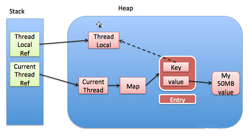

对于每一个Thread中，都有一个`ThreadLocalMap`类型的变量`threadLocals`，也就是说`ThreadLocalMap`被线程持有，其生命周期与线程生命周期一致。而对于`map`中使用的是数组存储`Entry`，(当哈希冲突的时候，使用**开放地址法**)，`Entry`里面使用的`key`为`threadlocal`变量，`value`为我们设置的值。

## ThreadLocal的内存泄漏

ThreadLocalMap使用ThreadLocal的弱引用作为key，如果ThreadLocal没有一个强引用来引用它，那个gc的时候一定会回收该对象，那么ThreadLocalMap中就会出现key为null的Entry，就无法访问这些key为null的value，如果线程迟迟不结束，就会存在value对象的强引用，导致value得不到及时回收，造成内存泄漏。

解决方案：**在调用ThreadLocal的get、set、remove方法的时候，会清除线程ThreadLocalMap中key为null的value**。但是这些被动的预防措施并不能预防不会内存泄漏，如：线程分配ThreadLocal后不在调用get、set以及remove方法；使用线程池的时候，线程执行结束，放入线程池不销毁又迟迟不使用，此时ThreadLocal被回收，导致内存泄漏。

最优解决方案：在ThreadLocal使用结束后，手动执行remove方法。

## ThreadLocal使用弱引用

- key 使用强引用：引用的ThreadLocal的对象被回收，但是ThreadLocalMap还持有ThreadLocal的强引用，如不进行手动删除，ThreadLocal不会被回收，导致Entry内存泄漏。
- key 使用弱引用：引用的ThreadLocal的对象被回收，由于ThreadLocalMap持有ThreadLocal的弱引用，即使没有手动删除，ThreadLocal也会被回收。对于key为null的value在下一次ThreadLocalMap调用set、get。remove的时候会被清除。

ThreadLocal不支持继承。通过以下的代码，我们可以知道线程是获得不到主线程的数值。这样就有了新的解决方法，即`InheritableThreadLocal`。

```java
public class ThreadTest5 {
    //创建线程变量
    public static ThreadLocal<String> threadLocal = new ThreadLocal<>();
    public static void main(String[] args) {
        threadLocal.set("hello world.");
        new Thread(()->{
            System.out.println("thread:"+threadLocal.get());
        }).start();
        System.out.println("main:"+threadLocal.get());
    }
}
```

改成`InheritableThreadLocal`使用：

```java
public class ThreadTest5 {
    //创建线程变量
    public static InheritableThreadLocal<String> threadLocal = new InheritableThreadLocal<>();
    public static void main(String[] args) {
        threadLocal.set("hello world.");
        new Thread(()->{
            System.out.println("thread:"+threadLocal.get());
        }).start();
        System.out.println("main:"+threadLocal.get());
    }
}
```

## SimpleDateFormat的线程不安全

SimpleDateFormat是Java提供的一个格式化和解析日期的工具类，但是他不是线程安全的，所以多个线程共用一个SimpleDateFormat实例对日期进行解析或者格式化会导致程序出错。

```java
class SimpleDateFormatTest {

    static SimpleDateFormat sdf = new SimpleDateFormat("yyyy-MM-dd HH:mm:ss");

    public static void main(String[] args) {
        for(int i=0;i<10;i++){
            new Thread(()->{
                try {
                    System.out.println(sdf.parse("2021-05-12 13:38:00"));
                } catch (ParseException e) {
                    e.printStackTrace();
                }
            }).start();
        }
    }
}
//运行会抛出异常
```

通过SimpleDateFormat的源码可以看出来，是因为Calendar不是线程安全的。其主要原因是Calendar中对存放日期数据的变量操作不是线程安全的。

**解决方法**

* 每次使用都new一个SimpleDateFormat对象，保证每个实例都使用自己的Calendar实例，但是使用后又要回收对象，代价较大。
* 在日期格式化的时候加锁，保证对属性的设置是原子性的，但者意味着多个线程要竞争锁，导致系统的响应性能降低。
* 使用 ThreadLocal，这样每个线程只需要使用一个 SimpleDateFormat 实例 ，这相比第一种方式大大节省了对象的创建销毁开销，并且不需要使多个线程同步。

```java
class SimpleDateFormatTest {
    //创建ThreadLocal实例，在每一次使用get方法的时候都会触发initialValue函数，创建当前线程所需要的对象。
    static ThreadLocal<SimpleDateFormat> threadLocalSdf = new ThreadLocal<SimpleDateFormat>(){
        @Override
        protected SimpleDateFormat initialValue() {
            return new SimpleDateFormat("yyyy-MM-dd HH:mm:ss");
        }
    };

    public static void main(String[] args) {
        for(int i=0;i<10;i++){
            new Thread(()->{
                try {
                    System.out.println(threadLocalSdf.get().parse("2021-05-12 13:38:00"));
                } catch (ParseException e) {
                    e.printStackTrace();
                }finally {
                    //使用完毕后记得移除，避免内存泄漏
                    threadLocalSdf.remove();
                }
            }).start();
        }
    }
}
```

# 缓存一致性协议（MESI）

对于JMM模型，它的问题在于如何保证各个CPU缓存中的数据是一致的，也就是CPU的缓存一致性问题。

MESI是当前最主流的缓存一致性协议，它有四个状态，可用2bit表示，他们分别是：


通过定义这四种状态，配合“**嗅探**”技术来完成以下的功能（嗅探技术就是能够嗅探其他处理器访问主内存和它们的内部缓存）

* 对于M状态的缓存行，必须时刻监听所有视图读取该缓存行对应的主存地址的操作，如果监听到，则必须在此操作执行前把其缓存行中的数据写回CPU。
* 对于S状态的缓存行，必须时刻监听使该缓存行无效或者独享该缓存行的请求，如果监听到，则必须将该缓存行状态设置成I状态。
* 对于E状态的缓存行，必须时刻监听其他试图读取该缓存行对应的主存地址的操作，如果监听到，则必须将该缓存行状态设置成S状态。
* 只有E和M可以进行写操作而且不需要额外操作，如果想对S状态的缓存字段进行写操作，那必须先发送一个RFO(Request-For-Ownership)广播，该广播可以让其他CPU的缓存中的相同数据的字段失效，即变成I状态。 

通过上面的机制可以使得处理器在每次读写操作都是原子的，并且每次读到的数据都是最新的。

# happens-before原则

A happens-before B就是A先行发生于B，定义为hb(A, B)。在Java内存模型中，happens-before的意思是**前一个操作的结果可以被后续操作获取**。

**需要的原因**：JVM会对代码进行编译优化，会出现指令重排的情况，为了避免编译优化对并发编程安全性的影响，需要happens-before规则定义一些禁止编译优化的场景，保证变法变成的准确性。

happens-before原则主要有以下7点：

* 程序次序规则：在一个线程内一段代码的执行结果是有序的。对于指令重排，无论它怎么排，结果是按照我们代码的顺序生成的不会变。
* 管程锁定规则：无论在单线程还是多线程环境中，对于同一个锁来说，一个线程对这个解锁后，另一个线程获取了这个锁能看到前一个线程的操作结果。（管程是一种通用的同步原语，synchronized就是管程的实现）
* 线程启动规则：在主线程A执行的过程中，启动子线程B，那么线程A在启动子线程B之前对共享变量的修改结果对线程B可见。
* 线程终止规则：在主线程A执行过程中，子线程B终止，那么线程B在终止之前对共享变量的结果在线程A中可见。
* 线程中断规则：对线程interrupt()方法的调用先行发生于被中断线程代码检测到中断事件的发生，可以通过Thread.interrupted()检测到是否发生中断。
* 传递规则：happens-before原则具有传递性，即A happens-before B ， B happens-before C，那么A happens-before C。
* 对象终结规则：对于一个对象，初始化到结束，也就是构造函数执行的结束一定 happens-before它的finalize()方法。

# synchronized

由于java中的线程与操作系统中的原生线程一一对应的，所以当阻塞一个线程时，需要从用户态切换到内核态执行阻塞操作，这是很费时的操作，而synchronized的使用就会导致上下文切换。

synchronized的内存语义用于解决共享变量内存可见性问题。

也就是加锁和释放锁的语义。当获取锁后会清空锁块内本地内存中将会用到的共享变量，在使用这些共享变量时从主内存进行加载，在释放锁时将本地内存中修改的共享变量刷新回主内存。

## synchronized的锁升级

对于java对象，每个对象都拥有对象头，锁的状态在对象头的Mark Word中表示。

当有线程访问同步代码或方法时，线程只需要判断对象头的Mark Word中判断一下是否有**偏向锁**指向线程ID，没有的话则将偏向锁状态记为1，将ID存入；

当有另外一个线程竞争获取这个锁时，由于该锁已经是偏向锁，当发现对象头Mark Word 中的线程 ID 不是自己的线程 ID，查看java对象头的记录的线程是否存活，如果存活，则查看该线程的栈帧信息，如果还持有这个锁对象，则暂停拥有偏向锁的线程（安全点），升级为**轻量级锁**；如果没有存活，其他线程竞争将Mark Word 中的线程 ID 为自己的 ID，继续保持偏向锁状态。

升级为轻量级锁的时候，其他线程会不断的CAS操作，如果失败，说明其他线程访问锁也会失败，就会转化成**重量级锁**，在这种状态下，JVM会阻塞加锁失败的线程，并且在目标锁被释放的时候，唤醒这些线程。

# volatile

使用锁的方式可以解决共享变量内存可见性问题，但因为锁太笨重，因为它会带来线程上下文的切换开销。对于解决内存可见性问题，Java还提供了一种弱形式的同步也就是volatile。

当一个变量被声明为volatile时，线程在写入变量时不会把值缓存在寄存器或者其他地方，而是会把值刷新回主内存。当其他线程读取该共享变量时，会从主内存重新获取最新值，而不是使用当前线程的工作内存中的值。volatile的内存语义和synchronized有相似之处，具体来说就是，当线程写入了volatile变量值时就等价于线程退出 synchronized同步块（把写入工作内存的变量值同步到主内存)，读取 volatile变量值时就相当于进入同步块（先清空本地内存变量值，再从主内存获取最新值)。

## volatile的特性

* 可见性，它会保证修改的值会立即被更新到主存，当有其他线程需要读取时，它会去内存中读取新值。使用synchronized和Lock也可以保证可见性。
* 非原子性
* 防止指令重排

观察加入volatile关键字，在生成的字节码文件中，会多出一个lock前缀，lock前缀指令实际上相当于一个内存屏障（也称为内存栅栏），内存屏障会提供3个功能：

* 它确保指令重排序时不会把其后的指令排到内存屏障其前的位置，也不会把前面的指令排到内存屏障的后面，即执行到内存屏障这句指令时，他前面的操作已经完成。
* 他会强制对缓存的修改操作立即写入主存。
* 如果是写操作，他会导致其他CPU中对应的缓存行无效。

## **一般在什么时候使用volatile关键字**?

* **写入变量值不依赖变量的当前值时**。因为如果依赖当前值，将是获取-计算-写入三步操作，这三步操作不是原子性的，而volatile不保证原子性。
* 读写变量值时没有加锁。因为加锁本身已经保证了内存可见性，这时候不需要把变量声明为volatile的。

# 伪共享

为了解决计算机系统中主内存和CPU之间运行速度差问题，会在CPU与主内存之间添加一级或者多级高速缓冲存储器。这个Cache一般是被集成到CPU内部的，所以也叫CPU Cache，其中缓存中存储的单位是Cache行。

由于存放到Cache行的是内存块而不是单个变量，所以可能会把多个变量存放到一个Cache行中。当多个线程同时修改一个缓存行里面的多个变量时，由于同时只能有一个线程操作缓存行，所以相比将每个变量放到一个缓存行，性能会有所下降，这就是伪共享。

**伪共享的解决措施**

* 创建一个变量的时候用填充字段填充该变量所在的缓存行，这样就可以避免将多个变量存放到同一个缓存行中。
* JDK8提供的一个sun.misc.Contended注解，用来解决伪共享问题，该注解可以修饰类也可以修饰变量。

> 在默认情况下该注解只是用于Java的核心类，如果用户需要使用，需要添加JVM参数：`-XX:-RestrictContended`。填充的宽度默认为128，要自定义宽度则可以设置`-XX:ContendedPaddingWidth`参数。

# ThreadLocalRandom类

ThreadLocalRandom类是JDK7在JUC包下新增的随机数生成器，它弥补了Random类在多线程下的缺陷。

>缺陷：每个Random实例里面都有一个**原子性的种子变量**用来记录当前的种子值，当要生成新的随机数时需要根据当前种子计算新的种子并更新回原子变量。在多线程下使用单个Random实例生成随机数时，当多个线程同时计算随机数来计算新的种子时，多个线程会竞争同一个原子变量的更新操作，**由于原子变量的更新是CAS操作，同时只有一个线程会成功，所以会造成大量线程进行自旋重试，这会降低并发性能**，所以ThreadLocalRandom应运而生。

对于ThreadLocalRandom其原理和ThreadLocal一致。也是通过每个线程复制维护一个种子变量，这样就避免了对该原子变量的竞争问题，从而大大的提高并发性能。

#  AtomicInteger原理

底层使用的是`Usafe`和`CAS`机制来实现的，其中`AtomicInteger`类中有两个变量，他们分别是`value`和`valueOffset`，前者是使用`volatile`进行修饰的，以便value的更新能够告知其他线程。而对于后者`valueOffset`变量，表示的是`value`变量在内存中的偏移量，用以实现原子操作。

对于JDK1.8对于AtomicLong添加了优化类LongAdder，来减少大量线程CAS失败。

#  LongAdder原理分析

LongAdder是JDK1.8新增的原子性操作类，LongAdder在内部维护了一个Cells数组，每一个Cell里面有一个初始值为0的value变量，在同等并发量的情况下，争夺单个变量的线程就会减少。

基本思路就是分散热点。使用LongAdder时，则是在内部维护多个Cell变量，每个Cell里面有一个初始值为0的 long型变量，这样，在同等并发量的情况下，争夺单个变量更新操作的线程量会减少，这变相地减少了争夺共享资源的并发量。另外，多个线程在争夺同一个Cell原子变量时如果失败了，它并不是在当前Cell变量上一直自旋CAS重试，而是尝试在其他Cell的变量上进行CAS尝试，这个改变增加了当前线程重试CAS成功的可能性。最后,在获取LongAdder当前值时，是把所有Cell变量的value值累加后再加上 base返回的。

> LongAdder中Cell数组的创建是惰性加载的（由于Cells占用的内存相对比较大的）。初始条件下数组是NULL的和一个基变量base。

# CopyOnWriteArrayList

CopyOnWriteArrayList 是一个线程安全的 ArrayList，对其进行的修改操作都是在底层的一个复制的数组（**快照**）上进行的 ，也就是使用了写时复制策略。

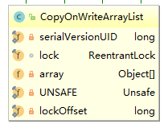

通过上面类图可以发现，每个CopyOnWriteArrayList对象里面有一个array数组对象用来存放具体的元素，**ReentrantLock独占锁**对象用来保证同时只有一个线程对array进行修改。

对于CopyOnWriteArrayList的所有添加、修改和删除操作，都是在快照上操作。如对于插入操作，先将原数据复制到新数组，在新数据上执行插入操作，再将array指向新数组；对于更新也是先复制原数组到新数组，然后改变新数组，改变指向即可。删除则要区分删除元素的位置，是末尾元素还是中间元素，源代码如下。

```java
public E remove(int index) {
    final ReentrantLock lock = this.lock;
    //获得锁
    lock.lock();
    try {
        //获得array数组以及其长度
        Object[] elements = getArray();
        int len = elements.length;
        E oldValue = get(elements, index);
        //删除元素距离尾部的位置，如果是0，则是末尾元素，则将前面的len-1个元素复制
        int numMoved = len - index - 1;
        if (numMoved == 0)
            setArray(Arrays.copyOf(elements, len - 1));
        else {
            //不是结尾元素，则要将它分为前半部分或后半部分进行复制
            Object[] newElements = new Object[len - 1];
            System.arraycopy(elements, 0, newElements, 0, index);
            System.arraycopy(elements, index + 1, newElements, index,
                             numMoved);
            //将array设置成新创建的数组。
            setArray(newElements);
        }
        return oldValue;
    } finally {
        //释放锁
        lock.unlock();
    }
}
```

CopyOnWriteArrayList中迭代器是弱一致性的。所谓弱一致性是指返回迭代器后，其他线程对list的增删查改对迭代器是不可见的。

```java
public ListIterator<E> listIterator() {
    return new COWIterator<E>(getArray(), 0);
}
//其中getArray()得到的是array的一个快照，因为他们传递的是一个引用，当其他线程没有进行增删改，则当前的版本是最新的，但是当有增删改，那么当前快照就不是最新的了，因为增删改后的数组被新数组替换，而老数组被迭代器引用，所以迭代器对于新的增删改是不可见的。
```

应用场景：

* 读操作尽可能的快，写操作速度没有要求，慢一点也可以；
* 读多写少的场景，如黑名单，一般采用定时更新，不需要时常更新，对于每一次的请求查询黑名单。

优缺点：

* 迭代期间允许修改集合内容。

```java
CopyOnWriteArrayList<Integer> list = new CopyOnWriteArrayList<>(new Integer[]{1, 2, 3});
System.out.println(list); //[1, 2, 3]
//Get iterator 1
Iterator<Integer> itr1 = list.iterator();
//Add one element and verify list is updated
list.add(4);
System.out.println(list); //[1, 2, 3, 4]
```

* 内存占用问题，内存中同时驻扎两个对象的内存，占用额外的内存空间。
* 数据一致性问题，由于修改的是副本，修改是不能实时被看到，如果你希望写入的数据，马上能被其他线程看到，则不适用。

COW技术的应用：Linux的进程fork函数虚拟空间结构，不为其分配物理内存，共享父进程的物理内存，当子线程需要改变相应段的行为发生后，再为子进程响应的段分配物理空间。

# LockSupport工具类

该类是`rt.jar`包中的一个工具类，它的作用主要是挂起和唤醒线程，该工具来是创建其他同步类的基础。

LockSupport类与每个使用它的线程都会关联一个许可证，在默认情况下调用LockSupport类的方法的线程是不持有许可证的（许可证的持有是通过unpark函数）。**LockSupport 底层是使用Unsafe类的park和unpark方法实现的**。

* `void park();`如果调用park方法的线程已经拿到了与LockSupport关联的许可证，则调用`LockSupport.park();`方法会立即返回，否则调用线程会被禁止参与线程的调度，也就是被阻塞挂起。该方法是**不可重入的**。
* `void unpark(Thread thread);`当一个线程调用unpark时，如果参数thread线程没有持有thread 与 LockSupport类关联的许可证，则让 thread线程持有。如果thread之前因调用park()而被挂起，则调用unpark后，该线程会被唤醒。如果thread之前没有调用park，则调用unpark方法后，再调用park 方法，其会立刻返回。

```java
public class LockSupportTest {
    public static void main(String[] args) {
        System.out.println("begin park");
        //使当前线程获取到许可证
        //LockSupport.unpark(Thread.currentThread());
        //调用park方法
        LockSupport.park();
        System.out.println("end park");
    }
}
//运行结果1:因为没有获取到许可证，就会阻塞。
//begin park
//运行结果2：当我们去掉注释，当前线程也获得了许可证，就会唤醒因此挂起的当前线程，所以打印结果为：
//begin park
//end park
```

> 注意，在学习过程中，在上面的程序中`unpark`和`park`方法不能相反，这样运行结果还是1。因为在调用`park`主线程已经阻塞，后面的`unpark`方法已经没有执行的机会，所以运行结果还是1。

线程在从`park`方法中返回时并不会携带具体的返回原因，调用者需要自行检测，例如再次检查之前调用park方法的条件是否仍然满足以予以推测。

# AbstractQueuedSynchronizer抽象同步队列

## AQS自我理解

同步队列的作用在于管理竞争资源的线程，当一个线程竞争资源失败会被记录到同步队列的末端，并且以自旋的方式循环检查能够成功取得资源。当用户获取锁失败后，将会以Node节点的形式放入到AQS双向链表的末尾，加入后就会CAS（要么获取锁，要么中断)，如果该节点不是队列中的第一个节点（即前驱节点不是head），就会阻塞该线程停止CAS；若当前节点是队列中第一个节点，则在资源释放的时候，唤醒下一个节点，CAS获得锁资源。

```java
private void setHead(Node node) {
    head = node;
    node.thread = null;//可见头节点是一个虚拟节点，没有实际的数据
    node.prev = null;
}
```

**入队源码(主要流程)**

```java
// java.util.concurrent.locks.AbstractQueuedSynchronizer
final boolean acquireQueued(final Node node, int arg) {
	// 标记是否成功拿到资源
	boolean failed = true;
    // 标记等待过程中是否中断过
    boolean interrupted = false;
    // 开始自旋，要么获取锁，要么中断
    for (;;) {
        // 获取当前节点的前驱节点
        final Node p = node.predecessor();
        //如果p是头结点，说明当前节点在真实数据队列的首部，就尝试获取锁（别忘了头结点是虚节点）
        if (p == head && tryAcquire(arg)) {
            // 获取锁成功，头指针移动到当前node
            setHead(node);
            p.next = null; // help GC
            failed = false;
            return interrupted;
        }
        //说明p为头节点且当前没有获取到锁（可能是非公平锁被抢占了）或者是p不为头结点，这个时候就要判断当前node是否要被阻塞（被阻塞条件：前驱节点的waitStatus为-1），防止无限循环浪费资源。
        if (shouldParkAfterFailedAcquire(p, node) && parkAndCheckInterrupt())
            interrupted = true;
    }
}
```

## AQS结构组成

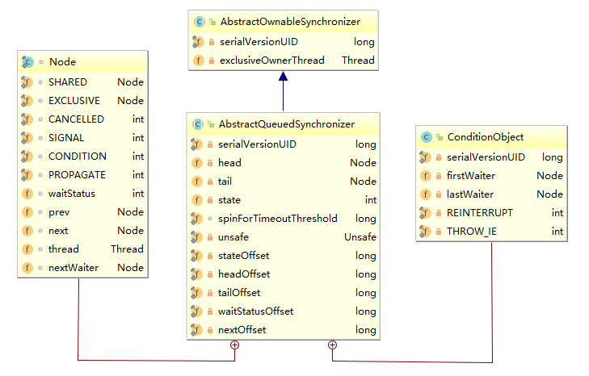

由图可以看到，AQS是一个双向队列，其内部通过节点`head`和`tail`记录队首和队尾元素，队列元素的类型是`Node`。对于`Node`中的`thread`变量用于存放进入AQS队列里面的线程，他也有前驱和后继节点；AQS继承`AbstractOwnableSynchronizer`,该抽象类中有个`Thread`类型的变量`exclusiveOwnerThread`，用于存储当前持有锁的线程。

在AQS中维持了一个单一的状态信息`state`（用`volatile`修饰），可以通过`int getState()` 、 `setState(int newState)` 、 `boolean compareAndSetState(int expect, int update)`方法修改其值。

AQS 有个两个内部类，分别是`Node`和`ConditionObject`，前者用来表示AQS中节点，后者用来结合锁实现线程同步。ConditionObject实现了条件队列的组织形式，包含一个起始节点(`firstWaiter`)和一个末尾节点(`lastWaiter`)，类型为`Node`。

## 条件队列（拓）

应用可以创建多个`ConditionObject`对象，每个对象都对应一个条件队列，对于同一个条件队列而言，其中的线程所等待的条件是相同的。

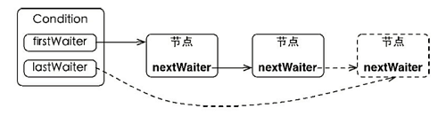

```java
public final void await() throws InterruptedException {
    if (Thread.interrupted())
        throw new InterruptedException();
    Node node = addConditionWaiter();//把当前线程的节点加入到等待队列中
    int savedState = fullyRelease(node);//由于调用await()方法的线程是已经获取了锁的，所以在加入到等待队列之后，需要去释放锁，并且唤醒后继节点线程。
    int interruptMode = 0;
    while (!isOnSyncQueue(node)) {
        LockSupport.park(this);//挂起当前线程，当别的线程调用了signal()，并且是当前线程被唤醒的时候才从park()方法返回
        if ((interruptMode = checkInterruptWhileWaiting(node)) != 0)
            break;
    }
    if (acquireQueued(node, savedState) && interruptMode != THROW_IE)//当被唤醒后，该线程会尝试去获取锁，否则加入到等待队列中，等待前节点唤醒。
        interruptMode = REINTERRUPT;
    if (node.nextWaiter != null) // clean up if cancelled
        unlinkCancelledWaiters();
    if (interruptMode != 0)
        reportInterruptAfterWait(interruptMode);
}
```

当线程调用 await 方法时，该线程会被包装成结点添加到条件队列的末端，并释放持有的资源,唤醒该节点的后继节点，最后使用`LockSupport.park(this);`方法阻塞自己。当条件得以满足时，方法`signal()`可以将条件队列中的一个或全部线程结点从条件队列转移到同步队列以参与竞争资源。

```java
private void doSignal(Node first) {
    do {
        if ( (firstWaiter = first.nextWaiter) == null)
            lastWaiter = null;
        first.nextWaiter = null;
    } while (!transferForSignal(first) &&
             (first = firstWaiter) != null);//从firstWaiter遍历所有的节点，将他们使用transferForSignal方法加到等待队列中。
}
//在下面的方法transferForSignal中，将node节点改变指向，加入到等待队列中
final boolean transferForSignal(Node node) {
    /*
         * If cannot change waitStatus, the node has been cancelled.
         */
    if (!compareAndSetWaitStatus(node, Node.CONDITION, 0))
        return false;

    /*
         * Splice onto queue and try to set waitStatus of predecessor to
         * indicate that thread is (probably) waiting. If cancelled or
         * attempt to set waitStatus fails, wake up to resync (in which
         * case the waitStatus can be transiently and harmlessly wrong).
         */
    Node p = enq(node);//改变该节点的指向，加入到等待队列中。
    int ws = p.waitStatus;
    if (ws > 0 || !compareAndSetWaitStatus(p, ws, Node.SIGNAL))
        LockSupport.unpark(node.thread);
    return true;
}
```

## AQS的相关操作

对于 AQS 来说，线程同步的关键是对状态值state进行操作。  根据state是否属于一个线程，操作state的方式分为独占方式和共享方式。

**独占方式**获取的资源是与具体线程绑定的，就是说如果一个线程获取到了资源， 就会标记这个线程获取资源，其他线程再尝试操作 state 获取资源时会发现当前该资源不是自己持有的，就会在获取失败后被阻塞。 比如独占锁 ReentrantLock 的实现， 当一个线程获取了 ReentrantLock 的锁后，在 AQS 内部会首先使用 CAS 操作把 state 状态值从 0 变为 1 ，然后设置当前锁的持有者为当前线程，当该线程再次获取锁时发现它就是锁的持有者，则会把状态值从1变为 2，也就是设置可重入次数，而当另外一个线程获取锁时发现自己并不是该锁的持有者就会被放入 AQS 阻塞队列后挂起。

**共享方式**的资源与具体线程是不相关的，当多个线程去请求资源时通过 CAS 方 式竞争获取资源，当一个线程获取到了资源后，另外一个线程再次去获取时如果当前资源还能满足它的需要，则当前线程只需要使用 CAS 方式进行获取即可。 

对于独占方式，获取资源和释放资源的流程如下：

* 当线程调用`acquire(int arg)`方法获取独占资源的时，会首先使用`tryAcquire()`方法尝试获取资源，具体是设置state的状态，成功则直接返回，失败则将当前线程封装成类型为`Node.EXCLUSIVE`的Node节点插入到AQS阻塞队列的尾部，并调用`LockSupport. park(this)`方法挂起自己。
* 当一个线程调用`release(int arg）`方法时会尝试使用` tryRelease() `操作释放资源,是设置状态变量 state 的值，然后调用`LockSupport.unpark(thread）`方法激活 AQS 队列里面被阻塞的一个线程（thread）,这个线程通过下面的源码可以知道是头节点。

```java
public final boolean release(int arg) {
    if (tryRelease(arg)) {
        Node h = head;
        if (h != null && h.waitStatus != 0)
            unparkSuccessor(h);
        return true;
    }
    return false;
}
```

对于共享方式，获取资源和释放资源的流程与独占的方式一致，只是函数名和封装的节点类型不一致，分别为`acquireShared(int arg）`,`trγAcquireShared()`,`releaseShared(int arg)`和`tryReleaseShared()`，其中失败封装的节点类型为`Node.SHARED`。

>对于ReentrantLock，ReentrantReadWriteLock，semaphore以及CountDownlatch中都有AQS成员变量，他们也就对应的有state变量，对于每一种应用，state变量都有其不同的含义。
>
>对于 ReentrantLock 的实现来说， state 可以用来表示 当前线程获取锁的可重入次数 ；对于读写锁ReentrantReadWriteLock 来说， state 的高 16 位表示读状态，也就是获取该读锁的次数，低 16 位表示获取到写锁的线程的可重入次数； 对于 semaphore 来说， state 用来表示当前可用信号的个数；对于 CountDownlatch 来说，state 用来表示计数器当前的值。

# Condition条件变量

`notify()`和`wait()`是配合`synchronized`内置锁实现线程同步的。

`signal()`和`await()`方法也是配合基于AQS实现锁间实现线程同步的。

```java
public class ContionTest {
    public static void main(String[] args) {
        ReentrantLock lock = new ReentrantLock();
        Condition condition = lock.newCondition();
        
        new Thread(()->{
            lock.lock();
            try {
                System.out.println("begin await.");
                condition.await();
                System.out.println("end await.");
            } catch (InterruptedException e) {
                e.printStackTrace();
            }finally {
                lock.unlock();
            }

        }).start();

        new Thread(()->{
            lock.lock();
            try{
                System.out.println("begin signal.");
                condition.signal();
                System.out.println("end signal.");
            }finally {
                lock.unlock();
            }
        }).start();
        Thread.sleep(1000);
        System.out.println("main is over.");
    }
}
```

在上面的代码中，`lock.newCondition()`的作用其实是 new 了 一个在 AQS 内部声明的`ConditionObject`对象， `ConditionObject `是 AQS 的内部类，可以访问 AQS 内部的变量（例如状态变量 state）和方法。在每个条件变量内部都维护了一个条件队列，用来存放调用条件变量的`await()`方法时被阻塞的线程。

**注意这个条件队列和 AQS 队列不是一回事**。

# ReentrantLock

ReentrantLock是独占锁，它是基于AQS来实现的（Sync类直接继承自AQS）。在AQS的state状态值表示线程获取锁的可重入个数，在默认情况下， state 的值为 0 表示当前锁没有被任何线程持有。 当一个线程第一次获取该锁时会尝试使用 CAS 设置 state 的值为1，如果 CAS 成功则当前线程获取了该锁，然后记录该锁的持有者为当前线程。 在该线程没有释放锁的情况下第二次获取该锁后，状态值被设置为2， 这就是可重入次数。在该线程释放该锁时，会尝试使用 CAS 让状态值减1，如果减1后状态值为0,则当前线程释放该锁。

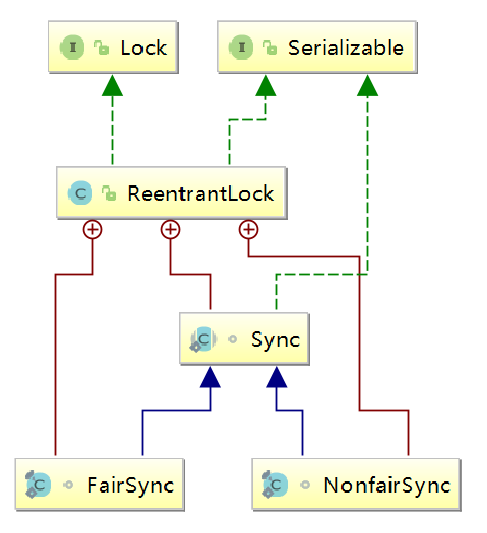

# ReentrantReadWriteLock

ReentrantReadWriteLock是采用读写分离的策略，允许多个线程可以同时获得读锁。

读写锁的内部维护了一个ReadLock 和一个 WriteLock，他们依赖于Sync（同样继承自AQS）实现具体的功能，并且提供了公平锁和非公平锁的实现。但是AQS中只是维护了一个状态，而ReentrantReadWriteLock需要维护读状态和写状态，它的解决方案是将32为state分为高16位和低16位。其中高16位表示读状态，也就是获取读锁次数；低16位表示获取到写锁的线程的可重入状态。

```java
static final int SHARED_SHIFT   = 16;
static final int SHARED_UNIT    = (1 << SHARED_SHIFT);
static final int MAX_COUNT      = (1 << SHARED_SHIFT) - 1;
static final int EXCLUSIVE_MASK = (1 << SHARED_SHIFT) - 1;
```

# ConcurrentLinkedQueue

ConcurrentLinkedQueue 是**线程安全的无界非阻塞队列**，其底层数据结构使用**单向链表实现**，对于入队和出队操作**使用 CAS** 来实现线程安全。

虽然其数据结构采用的是单链表方式实现的，但是其对象中有两个volitile修饰的属性，类型为Node的head和tail，用于存放队列头尾节点。**对于节点的内部使用的是UnSafe工具类提供的CAS算法来保证出队和入队时操作链表的原子性**。

其中部分源码如下：

```java
public class ConcurrentLinkedQueue<E> extends AbstractQueue<E>
        implements Queue<E>, java.io.Serializable {
    private static final long serialVersionUID = 196745693267521676L;
    //单链表中的节点，其中item用于存放节点的值，next用于指向链表的下一个节点，从而是一个单向的无界链表
    private static class Node<E> {
        volatile E item;
        volatile Node<E> next;
		
        Node(E item) {
            UNSAFE.putObject(this, itemOffset, item);
        }

        boolean casItem(E cmp, E val) {
            return UNSAFE.compareAndSwapObject(this, itemOffset, cmp, val);
        }

        void lazySetNext(Node<E> val) {
            UNSAFE.putOrderedObject(this, nextOffset, val);
        }

        boolean casNext(Node<E> cmp, Node<E> val) {
            return UNSAFE.compareAndSwapObject(this, nextOffset, cmp, val);
        }

        private static final sun.misc.Unsafe UNSAFE;
        private static final long itemOffset;
        private static final long nextOffset;

        static {
            try {
                UNSAFE = sun.misc.Unsafe.getUnsafe();
                Class<?> k = Node.class;
                itemOffset = UNSAFE.objectFieldOffset
                    (k.getDeclaredField("item"));
                nextOffset = UNSAFE.objectFieldOffset
                    (k.getDeclaredField("next"));
            } catch (Exception e) {
                throw new Error(e);
            }
        }
    }
    //头节点以及尾节点
    private transient volatile Node<E> head;
    private transient volatile Node<E> tail;
	
    //默认的头尾节点都是指向item为null的哨兵节点
    public ConcurrentLinkedQueue() {
        head = tail = new Node<E>(null);
    }

}
```

# LinkedBlockingQueue

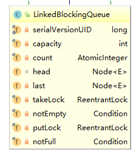

通过类图知道，LinkedBlockingQueue采用单向链表实现的，其中有两个节点来存放首尾节点，并且还有一个初始值为0的原子变量count，用于记录队列中原子变量的个数。其中还有两个ReentrantLock（takeLock和putLock）分别用于控制元素入队和出队的原子性，另外还有两个条件变量（notEmpty和notFull）用于存放进队和出队时被阻塞的线程，当队列为空或者为满的时候，将调用`take`、`poll`或者的线程放入到takeLock或putLock对应的AQS队列中。

LinkedBlockingQueue默认是无界的，大小为Integer.MAX_VALUE，在使用线程池的时候，将他作为阻塞队列，我们需要指定容量，这样可以避免队列过大造成机器负担或者内存爆满的现象。

>**BlockingQueue的操作比较**
>
>| 操作 | 抛出异常  |  特殊值  |  阻塞  |         超时         |
>| :--: | :-------: | :------: | :----: | :------------------: |
>| 插入 |  add(e)   | offer(e) | put(e) | offer(e, time, unit) |
>| 移除 | remove()  |  poll()  | take() |   poll(time, unit)   |
>| 检查 | element() |  peek()  | 不可用 |        不可用        |
>
>对于返回的特殊值，成功返回元素或者`true`，而对于失败则返回`null`或者`false`。

# ArrayBlockingQueue

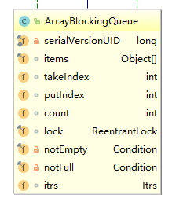

由类图可以看出，ArrayBlockingQueue的内部有一个数组items，用于存放入队的元素。其中takeindex和putindex分别表示出队入队元素的下标，count用于统计队列元素的个数。对于类图中的属性都没有用`volatile`修饰，因为其在锁块的内部，获取值的时候都是从主内存获取的，而不是从CPU缓存或者寄存器获取的；释放锁的时候会强制刷回主内存。

通过以下的源码可以知道，ArrayBlockingQueue是有界队列，所以在设置的时候需要传入大小；并且使用全局独占锁，导致同时只有一个线程进行入队或者出队操作。

```java
public void put(E e) throws InterruptedException {
    checkNotNull(e);//检查元素是否为NULL
    final ReentrantLock lock = this.lock;
    lock.lockInterruptibly();
    try {
        while (count == items.length)//防止虚假唤醒
            notFull.await();//阻塞线程，直到队列中可以放入元素
        enqueue(e);//进入队列
    } finally {
        lock.unlock();
    }
}
//其中,对于函数enqueue(E x)，进入队列，然后唤醒notEmpty队列中的线程
private void enqueue(E x) {
    final Object[] items = this.items;
    items[putIndex] = x;
    if (++putIndex == items.length)
        putIndex = 0;
    count++;
    notEmpty.signal();//唤醒执行take操作阻塞的线程
}
```

# PriorityBlockingQueue

PriorityBlockingQueue是带优先级的无界阻塞队列，每次出队都返回队列中优先级最高或者最低的元素。其内部实现是平衡二叉树堆实现的，所以直接遍历元素不保证有序，可以使用默认的比较规则也可以自定义。

## 类图结构

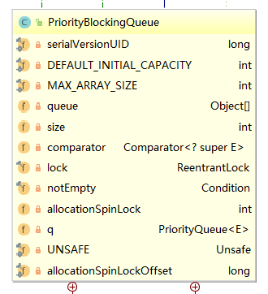

PriorityBlockingQueue内部有一个queue数组，用于存放队列元素。size用于存放队列中的元素个数。`allocationspinLock `是个自旋锁，它是一个事务变量，volatile变量，其使用CAS操作来保证同时只有一个线程可以扩容队列，状态为0或者1，其中0表示当前没有进行扩容，1表示当前正在扩容。

lock独占锁对象保证只有一个线程可以进行入队或出队操作。他有notEmpty队列，但是没有notFull队列，因为这里的put操作是无阻塞的（看出该队列是无界队列）。

## 优先级队列扩容

队列在put元素的时候，会判断queue数组中元素数量是否大于容量，大于容量都会进入扩容函数（`void tryGrow(Object[] array, int oldCap)`）,其中array表示旧数组，oldCap表示原有容量。

扩容：若oldCap<64，则newCap=oldCap +(oldCap + 2)；若oldCap>64，则newCap = oldCap +(oldCap /2)。

```java
public boolean offer(E e) {
    if (e == null)
        throw new NullPointerException();
    final ReentrantLock lock = this.lock;
    lock.lock();
    int n, cap;
    Object[] array;
    while ((n = size) >= (cap = (array = queue).length))
        tryGrow(array, cap);//扩容
    try {
        Comparator<? super E> cmp = comparator;
        if (cmp == null)
            siftUpComparable(n, e, array);
        else
            siftUpUsingComparator(n, e, array, cmp);
        size = n + 1;
        notEmpty.signal();
    } finally {
        lock.unlock();
    }
    return true;
}
```

```java
private void tryGrow(Object[] array, int oldCap) {
    lock.unlock(); // 扩容前释放锁，让其他线程可以进行入队出队操作
    Object[] newArray = null;
    if (allocationSpinLock == 0 &&
        UNSAFE.compareAndSwapInt(this, allocationSpinLockOffset,
                                 0, 1)) {
        try {
            int newCap = oldCap + ((oldCap < 64) ?
                                   (oldCap + 2) : // grow faster if small
                                   (oldCap >> 1));
            if (newCap - MAX_ARRAY_SIZE > 0) {//抛出异常
                int minCap = oldCap + 1;
                if (minCap < 0 || minCap > MAX_ARRAY_SIZE)
                    throw new OutOfMemoryError();
                newCap = MAX_ARRAY_SIZE;
            }
            if (newCap > oldCap && queue == array)
                newArray = new Object[newCap];
        } finally {
            allocationSpinLock = 0;
        }
    }
    //第一个线程CAS成功后，其他线程就会到达这里,然后让出CPU，让第一个线程得到执行(yield不能保证)
    if (newArray == null) // back off if another thread is allocating
        Thread.yield();
    lock.lock();
    if (newArray != null && queue == array) {
        //还没有线程执行拷贝，将原数组元素拷贝到新数组，并改变指针的指向
        queue = newArray;
        System.arraycopy(array, 0, newArray, 0, oldCap);
    }
}
```

对于上面的代码，即使其他线程让出CPU，后再次获得CPU，继续执行代码，发现`newArray==null`（扩容未完成）,将会退出函数`tryGrow`,后发现原有容量依然为queue的大小，再次进入扩容函数`tryGrow`,直到扩容成功。

# DelayQueue

DelayQueue是一个无界阻塞延迟队列，队列中每个元素都有一个过期时间，当从队列获取元素时，只有过期元素才会出队列。队列头元素是最快要过期的元素。

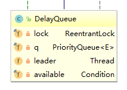

通过类图可以知道，延迟队列的内部是用优先级队列`PriorityQueue`，使用`ReentrantLock`实现线程同步。并且队列中元素都要实现`Delayed`接口。

其中条件变量`available`和`lock`锁是对应的，其目的是实现线程间的同步；其中leader变量的使用是基于`Leader-Follower`的模式的变体，用于减少不必要的线程等待。

> 当一个线程调用队列的take方法变成leader线程后，它会调用方法available.awaitNanos(delay);等待delay秒后,而对于非leader线程则会使用available.await();无限阻塞,leader 线程延迟时间过期后,会退出 take 方法,并通过调用available.signal()方法唤醒一个follwer线程，被唤醒的 follwer线程被选举为新的leader线程。

## DelayQueue的使用

```java
//首先放入DelayQueue队列的元素要实现Delayed的接口
class Item implements Delayed{
    /* 触发时间,对应的存储系统时间*/
    private long time;
    String name;

    public Item(String name, long time, TimeUnit unit) {
        this.name = name;
        this.time = System.currentTimeMillis() + (time > 0? unit.toMillis(time): 0);
    }

    @Override
    public long getDelay(TimeUnit unit) {
        return time - System.currentTimeMillis();
    }

    @Override
    public int compareTo(Delayed o) {
        Item item = (Item) o;
        long diff = this.time - item.time;
        if (diff >= 0) {
            return 1;
        }else {
            return -1;
        }
    }

    @Override
    public String toString() {
        return "Item{" +
                "time=" + time +
                ", name='" + name + '\'' +
                '}';
    }
}
//构建元素放入到队列中，后获取
public static void main(String[] args) throws InterruptedException {
    Item item1 = new Item("item1", 5, TimeUnit.SECONDS);
    Item item2 = new Item("item2",10, TimeUnit.SECONDS);
    Item item3 = new Item("item3",15, TimeUnit.SECONDS);
    DelayQueue<Item> queue = new DelayQueue<>();
    queue.put(item1);
    queue.put(item2);
    queue.put(item3);
    System.out.println("begin time:" +LocalDateTime.now().format(DateTimeFormatter.ISO_LOCAL_DATE_TIME));
    for (int i = 0; i < 3; i++) {
        Item take = queue.take();
        System.out.format("name:{%s}, time:{%s}\n",take.name, LocalDateTime.now().format(DateTimeFormatter.ISO_DATE_TIME));
    }
}
```

# ThreadPoolExecutor

线程池主要解决两个问题：

* 执行大量异步任务时线程池能够提供较好的性能，提高响应速度。在不使用线程池的时候，每当执行异步任务都需要新建一个线程，线程的创建和销毁需要开销，线程池中的线程都是可复用的。
* 提供了一种资源的限制的管理，比如限制线程的个数以及动态新增资源。

## Executors

Executors其实是一个工具类，他主要提供好多静态方法，用于返回不同的线程池类型。由下面的类图可以知道，有一个原子变量ctl，用于记录线程池的状态和线程池中线程的数量。

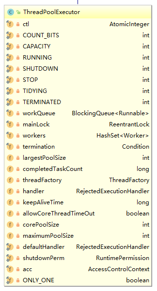

ctl变量是32位Integer类型。其中高三位表示线程池的状态，后面的29位用于记录线程池中线程的数量。

线程池的状态：

* RUNNING,接受新任务并且处理阻塞队列里的任务；
* SHUTDOWN,拒绝新任务，但是处理阻塞队列里的任务；
* STOP,拒绝新任务并抛弃阻塞队列里的任务，同时会中断正在处理的任务；
* TIDYING，所有任务都执行完（包含阻塞队列里面的任务）后当前线程池活动线程数为 0 ， 将要调用 terminated 方法；
* TERMINATED ： 终止状态。 terminated 方法调用完成以后的状态。

线程池的参数：

* corePoolSize:线程池核心线程个数。
* workQueue:用于保存等待执行的任务的阻塞队列，比如基于数组的有界 ArrayBlockingQueue、基于链表的无界 LinkedBlockingQueue、最多只有一个元素的同步队列 SynchronousQueue 及优先级队列 PriorityB lockingQueue 等。
* maximunPoolSize:线程池最大线程数量。
* ThreadFactory:创建线程的工厂。
* RejectedExecutionHandler:饱和策略，当队列满并且线程个数达到 maximunPoolSize 后采取的策略， 比如 AbortPolicy （抛出异常〉、 CallerRunsPolicy （使用调用者所在线程来运行任务） 、 DiscardOldestPolicy （调用 poll 丢弃一个任务，执行当前任务）及 DiscardPolicy （默默丢弃，不抛出异常〉
* keeyAliveTime:存活时间。如果当前线程池中的线程数量比核心线程数量多，并且是闲置状态，则这些闲置的线程能存活的最大时间。
* TimeUnit:存活时间的时间单位。

## 线程池的使用

线程池的种类有`newFixedThreadPool`，`newSingleThreadExecutor`，`newCachedThreadPool`以及`newScheduledThreadPool`,我们通过工具类`Executors`进行创建。

```
public class ThreadPoolTest {

    public static void main(String[] args) {
        ExecutorService executorService = Executors.newFixedThreadPool(3);
        for(int i=0;i<9;i++){
            executorService.submit(()->{
                //执行线程的名字
                System.out.println(Thread.currentThread().getName());
            });
        }
        executorService.shutdown();
    }
}
```

阿里规范中，不建议使用`Executors`创建线程池，而推荐使用`ThreadPoolExecutor`使用七个参数创建。

```java
//newFixedThreadPool和newSingleThreadExecutor,线程的数量固定，但是阻塞队列的最大值Integer.MAX_VALUE,可能会耗尽资源
//newCachedThreadPool和newScheduledThreadPool，可能创建过多的线程，耗尽资源
public static void main(String[] args) {
    //线程工厂以及饱和策略可使用默认值
    ThreadPoolExecutor threadPoolExecutor = new ThreadPoolExecutor(3, 3, 1, TimeUnit.SECONDS, new ArrayBlockingQueue<Runnable>(4));
    for(int i=0;i<9;i++){
        threadPoolExecutor.submit(()->{
            //执行线程的名字
            System.out.println(Thread.currentThread().getName());
        });
    }
    threadPoolExecutor.shutdown();
}
```

## 线程池使用注意

* 线程池使用FutureTask时，如果把拒绝策略设置成DiscardPolicy 和 DiscardOldestPolicy, 并且在被拒绝的任务的Future对象上调用了无参 get 方法，那么调用线程会一直被阻塞。
* 在日常的开发过程中为了便于线程的有效复用，经常会用到线程池，然而**使用完线程池如果不调用shutdown关闭线程池，会导致线程资源迟迟不被释放**。

# CountDownLatch

在开发过程中经常会遇到需要在主线程中开启多个并行执行任务，并且在主线程中需要等待所有的子线程执行完毕再进行汇总的场景，我们也可以使用join()方法在主线程中等待，但灵活性不如`CountDownLatch`。

不同之处我们可以看[CountDownLatch理解一：与join的区别](https://blog.csdn.net/zhutulang/article/details/48504487)。假设有工人A、B、C,他们三人的工作都是两个交阶段，对于C需要A，B都完成工作中的第一阶段后开始它的工作，而不是要A、B完成所有工作C才开始工作。而对于join方法，只有A、B的两个阶段完成C才能运行。

```java
class Worker extends Thread{
    private String name;
    private CountDownLatch countDownLatch;
    public Worker(String name, CountDownLatch countDownLatch) {
        this.name = name;
        this.countDownLatch = countDownLatch;
    }
    @Override
    public void run() {
        System.out.println(name+"开始工作");
        Thread.sleep(2000);
        System.out.println(name+"第一阶段工作完成");
        countDownLatch.countDown();
        Thread.sleep(2000);
        System.out.println(name+"第二阶段工作完成");
        System.out.println("工作完成");
    }
}
public class CountDownLatchTest {
    public static void main(String[] args) {
        CountDownLatch countDownLatch = new CountDownLatch(2);
        Worker a = new Worker("A", countDownLatch);
        Worker b = new Worker("B", countDownLatch);
        Worker c = new Worker("C", countDownLatch);
        a.start();
        b.start();
        countDownLatch.await();
        c.start();
        Thread.sleep(5000);//等待其他线程执行完毕
    }
}
```

# CyclicBarrier

对于CyclicBarrier，主要是解决CountDownLatch计数器的一次性问题，对于CountDownLatch当计数器的值为0的时候，再调用CountDownLatch的await或者countdown方法就会立即返回，达不到线程同步的效果。而对于CyclicBarrier它可以让一组线程全部达到一个状态后再全部同时执行。之所以叫作屏障是因为线程调用 await 方法后就会被阻塞，这个阻塞点就称为屏障点，等所有线程都调用了 await 方法后，线程们就会冲破屏障，继续向下运行。

如对上面的示例，我们稍作修改为A、B、C三个线程都要完成第一阶段后，才开始第二阶段的任务。

```java
public class CountDownLatchTest {
    public static void main(String[] args) {
        CyclicBarrier cyclicBarrier = new CyclicBarrier(3);
        Worker a = new Worker("A", cyclicBarrier);
        Worker b = new Worker("B", cyclicBarrier);
        Worker c = new Worker("C", cyclicBarrier);
        a.start();
        b.start();
        c.start();
        Thread.sleep(5000);
    }
}

class Worker extends Thread{

    private String name;
    private CyclicBarrier cyclicBarrier;

    public Worker(String name, CyclicBarrier cyclicBarrier) {
        this.name = name;
        this.cyclicBarrier = cyclicBarrier;
    }

    @Override
    public void run() {
        System.out.println(name+"开始工作");
        Thread.sleep(2000);
        System.out.println(name+"第一阶段工作完成");
        cyclicBarrier.await();
        Thread.sleep(2000);
        System.out.println(name+"第二阶段工作完成");
        System.out.println("工作完成");
    }
}
```

# Semaphore

Semaphore 信号量也是 Java 中的一个同步器，与 CountDownLatch 和 CycleBarrier 不同的是，它**内部的计数器是递增的**，并且在一开始初始化 Semaphore 时，可以指定一个初始值，但是并不需要知道需要同步的线程个数，而是在需要同步的地方调用 acquire 方法时指定需要同步的线程个数。

``` java
public static void main(String[] args) throws InterruptedException {
    //创建初始值为0的信号量
    Semaphore semaphore = new Semaphore(0);
    for(int i=0;i<10;i++){
        new Thread(()->{
            System.out.println("完成工作."+Thread.currentThread().getName());
            semaphore.release();
        }).start();
    }
    semaphore.acquire(10);//该代码会阻塞在这里，直到信号量增加到10
    System.out.println("main is over.");
}
```

# Unsafe

Java和C++语言的一个重要的区别就是Java中我们无法直接操作一块内存区域，不能像C++那样可以手动的申请和释放内存。而Java中的Unsafe类则提供了类似C++手动管理内存的能力。

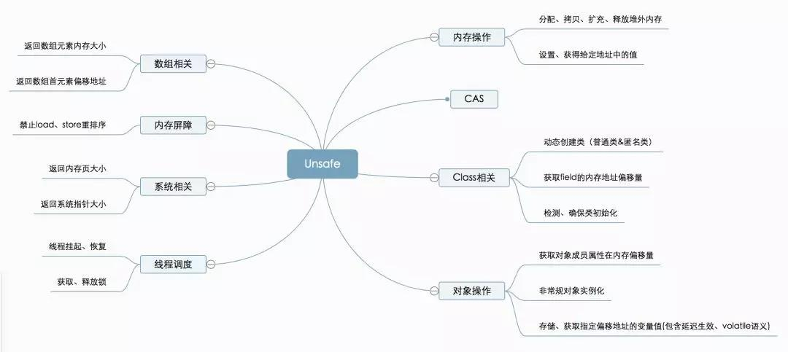

## 实例的获得

Unsafe类为单例实现，提供静态方法getUnsafe获取Unsafe实例，当且仅当调用getUnsafe方法的类为引导类加载器所加载时才合法，否则抛出SecurityException异常。

* 从`getUnsafe`方法的使用限制条件出发，通过Java命令行命令`-Xbootclasspath/a`把调用Unsafe相关方法的类A所在jar包路径追加到默认的bootstrap路径中，使得A被引导类加载器加载，从而通过`Unsafe.getUnsafe`方法安全的获取Unsafe实例。

```shell
java -Xbootclasspath/a: ${path}   // 其中path为调用Unsafe相关方法的类所在jar包路径 
```

* 通过反射获得单例对象`theUnsafe`

```java
private static Unsafe reflectGetUnsafe() {
    try {
      Field field = Unsafe.class.getDeclaredField("theUnsafe");
      field.setAccessible(true);
      return (Unsafe) field.get(null);
    } catch (Exception e) {
      log.error(e.getMessage(), e);
      return null;
    }
}
```

## 内存操作

这部分主要包括堆外内存的分配、拷贝、释放，给定地址值操作的方法。

> 堆外内存，存在于JVM管控之外的内存区域，Java对堆外内存的操作，依赖于Unsafe提供的操作堆外内存的native方法。
>
> 堆外内存的好处：
>
> - 对垃圾回收停顿的改善。由于堆外内存是直接受操作系统管理而不是JVM，所以当我们使用堆外内存时，即可保持较小的堆内内存规模，从而在GC时减少回收停顿对于应用的影响。
> - 提升程序I/O操作的性能。通常在I/O通信过程中，会存在堆内内存到堆外内存的数据拷贝操作，对于需要频繁进行内存间数据拷贝且生命周期较短的暂存数据，都建议存储到堆外内存。

## CAS相关

CAS操作包含三个操作数——内存位置、预期原值及新值。执行CAS操作的时候，将内存位置的值与预期原值比较，如果相匹配，那么处理器会自动将该位置值更新为新值，否则，处理器不做任何操作。我们都知道，CAS是一条CPU的原子指令（cmpxchg指令），不会造成所谓的数据不一致问题。Unsafe提供的CAS方法（如compareAndSwapXXX）底层实现即为CPU指令cmpxchg。

CAS在java.util.concurrent.atomic相关类、Java AQS、CurrentHashMap等实现上有非常广泛的应用。

## 线程调度

线程调度这部分包括线程挂起、恢复、锁机制等方法。

```java
//取消阻塞线程
public native void unpark(Object thread);
//阻塞线程
public native void park(boolean isAbsolute, long time);
//获得对象锁（可重入锁）
@Deprecated
public native void monitorEnter(Object o);
//释放对象锁
@Deprecated
public native void monitorExit(Object o);
//尝试获取对象锁
@Deprecated
public native boolean tryMonitorEnter(Object o);
```

Java锁和同步器框架的核心类AbstractQueuedSynchronizer，就是通过调用`LockSupport.park()`和`LockSupport.unpark()`实现线程的阻塞和唤醒的，而LockSupport的park、unpark方法实际是调用Unsafe的park、unpark方式来实现。

详细讲解可见[美团技术讲解](https://mp.weixin.qq.com/s/h3MB8p0sEA7VnrMXFq9NBA)，点击即可访问。