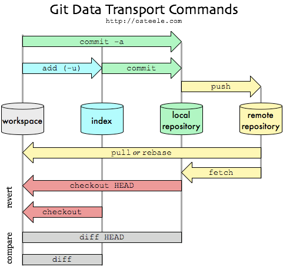

## 生成密钥

```bash
ssh-keygen -t rsa -C "3052720966@qq.com"
```

## 添加本地仓库到 github

```bash
1. git init
2. git remote add origin git@github.com:CSerxzm/CSerxzm.github.io.git
3. git branch -u origin/master
4. git pull
```

<!-- more -->

## 忽略已提交文件

1. 先用如下命令: `git rm -r --cached filename`
2. 再更新.gitignore 文件忽略相关文件

## 创建 git 使用步骤

1. 生成 ssh key： git bash 下运行 `ssh-keygen -t rsa -C "3052720966@qq.com"`,然后三个回车，密码为空，上传用户文件夹下的公钥 `id_rsa.pub`到服务器
2. 配置全局用户名 和邮箱

```bash
 git config –global user.name "cserxzm"
 git config –global user.email "3052720966@qq.com"
```

3. 下载代码

```bash
git clone https://github.com/CSerxzm/CSerxzm.github.io.git
```

4. 创建并切换分支

```bash
git checkout -b dev
```

5. 建立当前本地分支 dev 和远程 dev 分支 track

```bash
git branch -u origin/dev
```

6. 获取代码

```bash
git pull
```

7.提交代码

```bash
 git add .
 git commit -m "message"
 git push
```

## git 分支

1. 创建分支 `git branch <branch_name>`
2. 切换分支 `git checkout <branch_name>`
3. 创建并切换分支 `git checkout -b <branch_name>`
4. 显示本地分支 `git branch`
5. 显示远程分支 `git branch -r`
6. 显示本地和远程分支 `git branch -a`
7. 获取远程分支 `git pull origin <branch_name>` 或者 `git pull`
8. 推送到远程分支，`git push origin <local_branch_name >:< remote_branch_name>`; 若本地分支和远程分支 tracked，可简写为 `git push`; 若 `<local_branch_name>` 为空，即`git push origin :< remote_branch_name>`则删除远程分支
9. 获取远程新分支 `git checkout -b <local-branchname> origin/<remote_branchname>`,一般`local-branchname`和`remote_branchname`一致。
10. 删除本地分支 `git branch -d <branch_name>`; 删除远程分支 `git branch -d -r orign/<branch_name>`
11. 合并分支 `git merge <branch_name>`，即将 branch_name 合并到当前分支
12. 本地分支和远程分支相关联，`git branch --set-upstream-to=origin/<remote_branchname>`
13. 查看本地分支和远程分支是否 tracked `git branch -vv`
14. 分支重命名 `git branch -m <old_branch_name> <new_branch_name>`

## git 撤销

1. 撤销 add 且未 commit，撤销所有的文件：`git reset HEAD`；撤销单个文件：`git reset HEAD filefullname`
2. 撤销 commit

- `git reset –mixed`：此为默认方式，不带任何参数的 git reset，即时这种方式，它回退到某个版本
- `git reset –soft`：回退到某个版本，只回退了 commit 的信息，不会恢复到 index file 一级。如果还要提交，直接 commit 即可。
- `git reset –hard`：彻底回退到某个版本，本地的源码也会变为上一个版本的内容。

## git 区图解



## git 其他命令

1. 创建裸库： `git init --bare gitname.git`
2. 查看本地设置 `git config –list`
3. work 和 index 的比较 `git diff`;index 和 repository 比较 `git diff –staged`;work 和 repository 比较 `git diff HEAD`
4. git status 中文被转义 `git config –global core.quotePATH false`
5. master 分支仅发布不干活，dev 分支仅干活不发布
