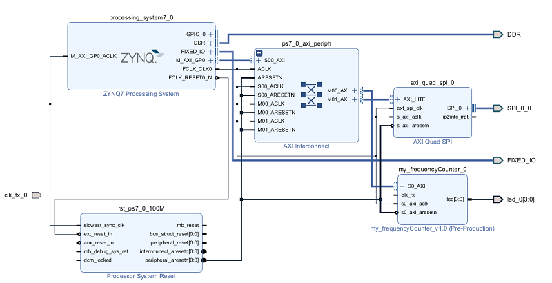

​ 在前面的一篇文章中，笔者使用的是 PS 部分的 SPI 进行相关的实验，发现其速度较慢，达不到项目的要求，需要传输的速度达到 MB/s 的级别，而目前使用设备树进行挂载设备的方式，只能达到 KB/s 的级别，这种方案是行不通的。

​ 通过分析，为了兼容各种外设，Linux 系统将各个设备封装成同一的 api 包，忽略底层的差异，而对于/dev/spi 方式的消耗就在这一层次，函数调用的层次比较多且复杂，导致设备之间的延时比较大，吞吐率不高。

​ 对于 ZYNQ，可以充分的利用 PL 部分的逻辑，使用 IP 核 AXI QUAD SPI，使用其作为控制器，将其寄存器地址映射到用户空间(mmap)，直接操作寄存器以达到控制 SPI 控制器，对连接到 Master 节点上的 Slave 进行控制。

<!-- more -->

​ 在这部分，需要 PL 部分的配合，其 Block Design 设计如下，其中 PL 部分的时钟频率为 100M，当然也可以超频，后面的测试部分也是基于这个时钟，Slave 的数目为 1，数据的宽度为 32bit，深度为 16，使能 FIFO，作为标准的 SPI 结构，其分配的基地址是 0x41E00000，长度为 4K。并且将其编译成 bitstream，下载到 Zynq 的 PL 部分。

> 注：忽略图中的 IP 核 my_frequencyCounter,只需要注意 axi_quad_spi 的分配首地址是 0x41E00000。



​ 运行在 Linux 的程序主要部分是`spi.h`和`spi.c`两部分，其中`spi.h`部分主要是结构体中寄存器的定义和映射关系，和项目中使用的主要的方法，而后`spi.c`部分就是主要的实现，通过官方手册给的相关的读写时序，进行指令的时序控制。

```c
// spi. h
#ifndef _SPI_H_
#define _SPI_H_
#include <stdio.h>
#include <stdio.h>
#include <stdlib.h>
#include <unistd.h>
#include <string.h>
#include <errno.h>
#include <signal.h>
#include <fcntl.h>
#include <ctype.h>
#include <termios.h>
#include <sys/types.h>
#include <sys/mman.h>

#define AXI_BASEADDER        0x41E00000

#define u8 unsigned char
#define u16 unsigned short
#define u32 unsigned long

typedef struct xilinx_spi_regs {
	u32 __space0__[7];
	u32 dgier;	/* Device Global Interrupt Enable Register (DGIER) */
	u32 ipisr;	/* IP Interrupt Status Register (IPISR) */
	u32 __space1__;
	u32 ipier;	/* IP Interrupt Enable Register (IPIER) */
	u32 __space2__[5];
	u32 srr;	/* Softare Reset Register (SRR) */
	u32 __space3__[7];
	u32 spicr;	/* SPI Control Register (SPICR) */
	u32 spisr;	/* SPI Status Register (SPISR) */
	u32 spidtr;	/* SPI Data Transmit Register (SPIDTR) */
	u32 spidrr;	/* SPI Data Receive Register (SPIDRR) */
	u32 spissr;	/* SPI Slave Select Register (SPISSR) */
	u32 spitfor;	/* SPI Transmit FIFO Occupancy Register (SPITFOR) */
	u32 spirfor;	/* SPI Receive FIFO Occupancy Register (SPIRFOR) */
}xilinx_spi_regs;

#define MAP_SIZE 4096UL
#define MAP_MASK (MAP_SIZE - 1)

// reg SPICR
#define SPE_MASK 1
#define MASTER_MASK 2
#define CPOL_MASK 3
#define CPHA_MASK 4
#define TX_RESET_MASK 5
#define RX_RESET_MASK 6
#define MANUAL_SELECT_MASK 7
#define MASTER_TRAN_MASK 8

// reg SPISR
#define RX_EMPTY_MASK 0
#define RX_FULL_MASK 1
#define TX_EMPTY_MASK 2
#define TX_FULL_MASK 3

#define FATAL do { fprintf(stderr, "Error at line %d, file %s (%d) [%s]\n", \
  __LINE__, __FILE__, errno, strerror(errno)); exit(1); } while(0)

static u32 fd;
static xilinx_spi_regs  *virt_addr;
static u16 slave_dev;// select dev, low active
static u32 spicr;

void reset();
void initSpicr(u8 master,u8 cpol,u8 cpha);
void transSpicr(u8 enable);
void changeSlave(u16 slavedev);
void init(u16 slavedev,u8 master,u8 cpol,u8 cpha);
void destroy();
int tx_empty();
int rx_empty();
void sendData(u32 *writeBufPtr,u16 byte_num);
void readData(u32 *readBufPtr,u16 byte_num);

#endif
```

```c
//spi.c
#include "spi.h"

void reset(){
    // To activate the software-generated reset, the value of 0x0000_000a must be written to the Software Reset Register.
    virt_addr->srr = 0x0000000A;
}

void initSpicr(u8 master,u8 cpol,u8 cpha){
    // 设置 spicr
    spicr =  0x80; // 0000_1000_0000
    // enable SPE
    spicr |=  ( 0x1 << SPE_MASK );
    // 设置是否为 master
    spicr = spicr ^ ( master << MASTER_MASK );
    //设置 cpol cpha
    spicr = spicr ^ ( cpol << CPOL_MASK );
    spicr = spicr ^ ( cpha << CPHA_MASK );
    // 禁用 trans
    spicr = spicr ^ ( 0x1 << MASTER_TRAN_MASK );
    // reset rx tx fifio
    spicr |=  ( 0x1 << TX_RESET_MASK );
    spicr |=  ( 0x1 << RX_RESET_MASK );
    virt_addr->spicr = spicr;
    // set rx tx fifio to 0
    spicr &= ~( 0x1 << TX_RESET_MASK );
    spicr &= ~( 0x1 << RX_RESET_MASK );
    virt_addr->spicr = spicr;
}

void transSpicr(u8 enable){
    if(enable){
        spicr &= ~( 0x1 << MASTER_TRAN_MASK );
    }else{
        spicr |=  ( 0x1 << MASTER_TRAN_MASK );
    }
    virt_addr->spicr = spicr;
}

void changeSlave(u16 slavedev){
    slave_dev = slavedev;
}

void init(u16 slavedev,u8 master,u8 cpol,u8 cpha){

    u32 base_addr = AXI_BASEADDER;

    fd = open("/dev/mem", O_RDWR | O_SYNC);
    if(fd == -1) FATAL;
    fflush(stdout);

    //将内核空间映射到用户空间
    virt_addr =(xilinx_spi_regs *)mmap(0,sizeof(xilinx_spi_regs), PROT_READ | PROT_WRITE, MAP_SHARED, fd, base_addr& ~MAP_MASK);

    if(virt_addr == (void *) -1) FATAL;

    printf("Memory mapped at address %p.\n", virt_addr);
    fflush(stdout);

    reset();
    initSpicr(master,cpol,cpha);
    slave_dev = slavedev;
}

void destroy(){
    // disable SPE
    spicr &= ~( 0x1 << SPE_MASK );
    if(munmap(virt_addr, sizeof(xilinx_spi_regs)) == -1) FATAL;
    close(fd);
}

int tx_empty(){
    u32 statereg = virt_addr->spisr;
    if( (statereg>>TX_EMPTY_MASK) & 0x1 ){
        return 1;
    }
    return 0;
}

int rx_empty(){
    u32 statereg = virt_addr->spisr;
    if( (statereg>>RX_EMPTY_MASK) & 0x1 ){
        return 1;
    }
    return 0;
}

void sendData(u32 *writeBufPtr,u16 byte_num){
    u32 data = 0;
    u32 statereg;
    transSpicr(0);// spicr 0x186 000(1)_1000_0110 dis_tran
    //Write cmd&addr&data to fifo
    for(u16  i=0; i < byte_num ; i = i+1 )
    {
        data = *writeBufPtr;
        virt_addr->spidtr = data;
        writeBufPtr = writeBufPtr + 1;
    }
    //choose slave_dev and trans
    virt_addr->spissr= slave_dev;
    transSpicr(1); // 000(0)_1000_0110 start trans
    //wait for trans to be done
    while(!tx_empty());
    virt_addr->spissr = 0xFF;// disconnect slave_dev
    transSpicr(0);// 000(1)_1000_0110 dis_tran
}

void readData(u32 *readBufPtr,u16 byte_num)
{
    u32 data = 0;
    virt_addr->spissr = slave_dev;
    transSpicr(1); // 000(0)_1000_0110 start trans
    for( u16 i=0; i < byte_num ; i = i+1 )
    {

        while(rx_empty());
        data = virt_addr->spidrr;
        *readBufPtr = data;
        readBufPtr = readBufPtr + 1;
    }
    virt_addr->spissr = 0xFF;// disconnect slave_dev
    transSpicr(0);// 000(1)_1000_0110 dis_tran
}
```

对于测试程序，这比较简单，通过调用`spi.h`中的函数，对 SPI 接口进行一定的测试，这里对于引脚约束则随意指定引脚，后将 MISO 和 MOSI 进行短接数据则可，测试程序,通过运行测试程序，可知其读写速度可达到 1MB/s,对速度不满意的，可以通过扩大 PL 部分的时钟频率，来达到满意的读写速度。

```c
#include "spi.h"
#include <sys/time.h>

#define CLOCK_PER_SEC 100000000

int main(int argc, char *argv[])
{
    u16 byte_num = 10;
    u32 writeBuf[100] ={0x0011,0x0022,0x0033,0x0044,0x0055,0x0066,0x0077,0x0088,0x0099,0x00aa};
    u32 readBuf[100];

    struct  timeval start, finish;
    long i=0;
    gettimeofday(&start,NULL);
    init(0xfe,1,0,0);
    //for(i=0;i<1000000;i++){
    for(i=0;i<100;i++){
       sendData(writeBuf, byte_num);
       //readData(readBuf, byte_num/2);
       readData(readBuf, byte_num);
    }
    destroy();
    gettimeofday(&finish,NULL);
    double total = (finish.tv_sec-start.tv_sec) + (double)(finish.tv_usec-start.tv_usec)/1000000;
    printf( "use %f seconds send and receive %ld bytes. \n", total, (byte_num*2*4*i) );


    for(u16 i=0;i<byte_num; i = i + 1 ){
        printf ("%lx " ,writeBuf[i]);
    }
    printf ("\n");
    for(u16 i=0;i<byte_num; i = i + 1 ){
        printf ("%lx " ,readBuf[i]);
    }
    printf ("\n");
    fflush(stdout);

    return 0;
}
```
