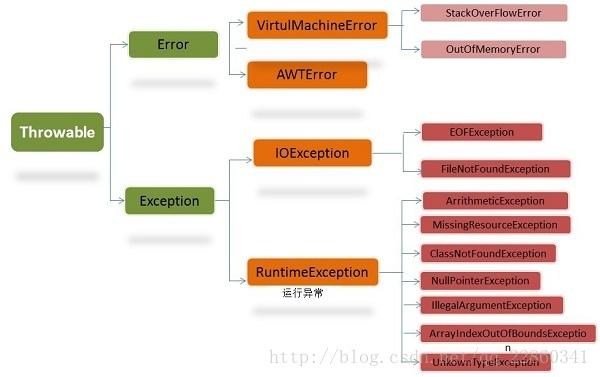

# 异常

## 什么是异常

在java运行的时候，常常会出现一些非正常的现象，这种情况成为运行错误。根据其错误可以分为错误和异常。所有抛出的异常都必须从**Throwable**派生而来。对于类Throwable有两个直接的子类：**Error**和**Exception**。

对于**Error**，是由java虚拟机生成并抛出的，通常情况下，我们不对该类异常进行处理，因为这种情况发生时，程序本身无法解决，只能通知用户胡，并通过其他程序进行干预，如死循环或者内存泄漏。

对于**Exception**，这是在程序执行时遇到的非正常情况或意外行为。这种情况不像Error类那样，程序运行时本身可以解决，由异常代码调整程序运行方向，使程序仍可以继续运行，直到正常结束。常见的由代码或调用的代码有错误，操作系统资源不可用，数组下标越界、算法溢出、除数为零等。**Exception**类对象是java程序处理或抛弃的对象，它有很多子类分别对应不同类型的异常。**Java编译器要求程序必须捕获或声明所有的非运行时异常（又叫Checked异常），但对运行时异常可以不做处理。**RuntimeException代表运行时由java虚拟机生成的异常，原因是编程错误，需要修改程序代码。其他则为非运行时异常，原因是程序碰到了意外情况，如输入/输出异常。

**简单而言，有程序错误导致的异常属于RunTimeException，而程序本身没有问题，但由于像I/O错误之类问题导致的异常为非运行时异常。**



## 异常关键字

java异常处理的关键字有5个：try、catch、throw、throws、finally。注意的问题如下：

* try、catch、finally三个语句不能单独使用，三者要组合成try……catch……finally、try……catch、try……finally三种结构，try可以有一个或多个语句，但finally只能有一个。
* try、catch、finally三个代码块内部变量的作用域在代码块累不，如果要三个块都要访问，需要将变量定义到这些块的外部。
* 若有多个catch块，只会匹配其中一个异常并执行catch块代码，而不会再执行别的catch块，并且匹配顺序时由上到下。
* throw关键字用于方法体内部，用来抛出一个Throwable类型的异常。如果抛出了检查异常，则还应该在头部声明方法可能抛出的异常类型。该方法的调用者也必须检查处理抛出的异常。如果所有的方法都层层上抛获取的异常，最终JVM会进行处理，处理也很简单，就是打印异常消息和堆栈信息。如果抛出的是Error 或 RuntimeException，则该方法的调用者可选择处理该异常。
* throws关键字作用域方法体外部的方法声明部分，用来声明方法可能会抛出某些异常。仅当抛出了检查异常，该方法的调用者才必须处理或重新抛出该异常。如果方法的调用者无力处理该异常，应该继续抛出。

```java
//对于下例，我们在函数cal中抛出异常，就要在他的调用者中用try catch进行捕获，或或者继续抛出，让上层处理，直到JVM处理，JVM处理就是打印跟踪栈信息，并终止程序。
public class Test {
    public static void main(String[] args) {
        try {
            cal();//try后面的代码只有一行，{}也不能省略。
        } catch (Exception e) {
            e.printStackTrace();
        }
    }
    public static void cal() throws Exception{
        int i=1/0;
    }
}
//继续抛出
public static void main(String[] args) throws Exception{
    cal();
}
//对于抛出异常的方式，我们也可以在函数中使用throw显式抛出。
public class Test {
    public static void main(String[] args) throws Exception{
        cal();
    }
    public static void cal() {
        try {
            throw new Exception();
        } catch (Exception e) {
            e.printStackTrace();
        }
    }
}
```

**throw和throws的区别**：

**1.作用不同**：throw用于在程序中抛出异常，throws用于声明在该方法内抛出了异常。

**2.使用位置不同**：throw位于方法体内部，用于单独语句使用。throws需要跟在方法参数列表后面，不能单独使用,**让方法的调用者处理该异常**。

**3.内容不同**：throw抛出一个异常对象，且只能有一个。throws后面跟异常类，且可以跟多个异常类。

## 异常的那些事

在使用try……catch……finally捕获异常的时候，我们应该注意catch块的顺序，我们应该将**所有的父类异常的catch块排在子类异常的后面**（简称为：先处理小异常，再处理大异常），否则后面的catch块永远没有执行的机会。

```java
try{
    //...
}catch(RuntimeException e){//1
    System.out.println("运行时异常");
}catch(NullPointerException ne){//2
    System.out.println("空指针异常");
}
//由于2处的异常是1处异常的子类，2处的异常永远没有执行机会。
```

当捕获到异常后，我们需要获得相关的异常信息，通过Exception e对象及其子类的实例来获得，常见的方法如下。

```java
getMessage()//返回该异常的详细描述字符串
printStackTrace()//将异常的跟踪栈信息输出到标准输出
printStackTrace(PrintStream s)//将异常的跟踪栈信息输出到指定输出流
getStackTrace()//返回该异常的跟踪栈信息
```

> 使用finally回收资源，是因为**JAVA的垃圾回收机制不会回收任何物理资源，垃圾回收机制只能回收堆内存中对象所占用的内存**。

通常将况下，不要再finally中使用如return或throw等导致方法终止的语句，因为一旦使用，将会导致try、catch块中的return、throw语句失效。

使用Throws声明抛出一个异常时，有一个限制：**子类方法中声明抛出的异常类型应该是父类方法声明抛出的异常类型的子类或相等**，子类方法中不允许比父类方法声明抛出更多异常。

```java
public class OverrideThrows{
    public void test() throws IOException{
        //.....
    }
}
public Sub extends OverrideThrows{
    //下面的代码无法通过编译：子类方法声明抛出了比父类方法更大的异常
    public void test() throws Exception{
        //.....
    }
}
```

## 自定义异常类

用户自定义异常类都应该继承Exception基类，自定义Runtime异常，继承RuntimeException基类。并且提供无参构造器和带一个字符串的有参构造器。

```java
public class MyException extends Exception{
    //异常类无参构造器
    public MyException(){}
    //带一个字符串的构造器，覆盖父类中的message属性
    public MyException(String msg){
        super(msg);
    }
}
```

在异常的处理，我们也涉及到设计模式中的职责链模式，程序先去捕获原始的异常，然后将异常信息记录下来，再抛出一个新的异常，用于对用户进行提醒。这样的做法，无论是安全性，还是用户的可读性，都有所提升。

```java
public cal throws MyException{
    try{
        //...
    }catch(SQLException e){
        //把原始异常记录下来，留给管理员
        //下面的异常中的message就是向用户传递的信息
        throw new MyException("主人，我肚子饿了，等吃完饭你再来吧");
    }
}
```

## 结语

在使用异常的过程中，一般的目标是：使代码混乱最小化；捕捉并保留诊断信息；通知合适的人员；采用合适的方式结束异常活动。

* 不要过度使用异常；
* 不要使用过于庞大的try块；
* 避免使用CatchAll语句；
* 不要忽略捕获道德异常。


