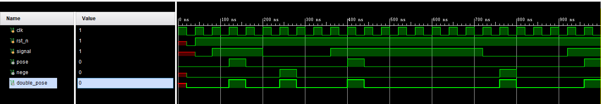

一般情况下，在系统中统一用`posedge`，避免用`negedge`，这样可以降低设计的复杂度，减少出错的几率。**边沿检测**用于检测信号的上升沿或下降沿，通常用于使能信号的捕捉等场景。

在FPGA中，对于信号的检测一般采用`posedge`上升沿触发或者是`negedge`下降沿触发，但是在同一个模块中不能使用同一信号的两种触发。即`always@(posedge clk or negedge clk)`，这种情况是会编译报错的。

<!-- more -->

所以一般采用寄存器进行时钟信号的缓存，一般使用如下代码。

```verilog
//其中signal为输入信号，clk为系统时钟，rst_n为复位时钟
reg reg_1,reg_2;
wire pose,nege.double_pose;
always@(posedge clk or negedge rst_n)
    begin
        if(!rst_n) begin
            reg_1 <= 1'b0;
            reg_2 <= 1'b0;
        end else begin
            reg_1 <= signal;
            reg_2 <= reg_1;
        end
    end

assign pose = reg_1 & (~reg_2);
assign pose = reg_2 & (~reg_1);
assign double_pose = reg_1^reg_2
```

通过仿真可以得到如下的时序图，可见得到的上下沿和触发沿会滞后一个时钟信号。



